# Initial Setup / Operations

`SSO` is used to provide single-sign-on authentication and authorization for internal web
applications, however, there are a few one-time prerequisites that need to be handled manually.

**NOTE: all commands should be performed on your HOST OS.**

## Google OAuth Setup

Configuring `sso` requires that we first configure a Google OAuth Project.

#### Create a new Google Cloud project

Use a web browser to access the Google Cloud [Resource Manager](
https://console.developers.google.com/cloud-resource-manager). Log into your account, if you have
not already done so.

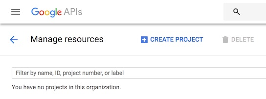

Select "Create Project". Provide the requested details (Project Name, etc), and click "Create". You
will have a notification when your project has finished being created; this should only take a
few moments.

#### Configure Google OAuth

Once your project has been created, click [here](
https://console.cloud.google.com/apis/credentials/consent) to configure the "OAuth consent screen"
for your project. Make sure that the name of the project you have created appears next to the words
"Google Cloud Platform" in the toolbar at the top of the website; if it does not, switch to your
project by clicking the name that appears there, and selecting the project you just created.

Fill in the field "Product name shown to users". We recommend the name `SSO Authenticator` for this
field. Hit "Save" after filling in this field.

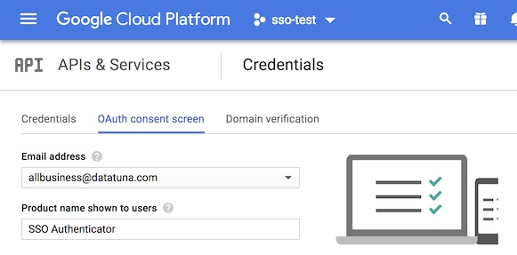

After this, click [here](https://console.cloud.google.com/apis/credentials) to configure
credentials for the service. Click the button labeled "Create credentials", and select the option
"OAuth client ID".

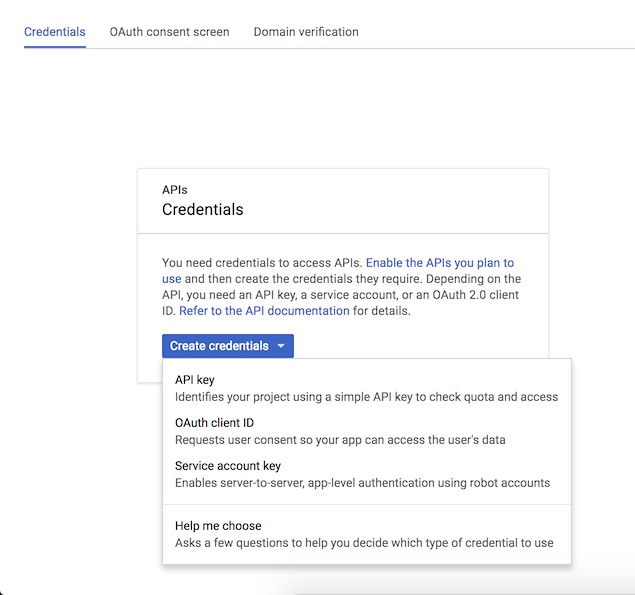

The next screen will ask you to choose an "Application Type"; select "Web application". You will be
asked to fill in three fields.
- **Name**: Any appropriate name is fine (e.g. `Dev`).
- **Authorized JavaScript origins**: We recommend leaving this field blank.
- **Authorized redirect URIs**: Add the URI of your `sso-proxy` deployment, with the path suffix
`/oauth2/callback`. For example, if your `sso-proxy` will  be accessible at the domain
`sso.example.com`, then add the URI `https://sso.example.com/oauth2/callback`.

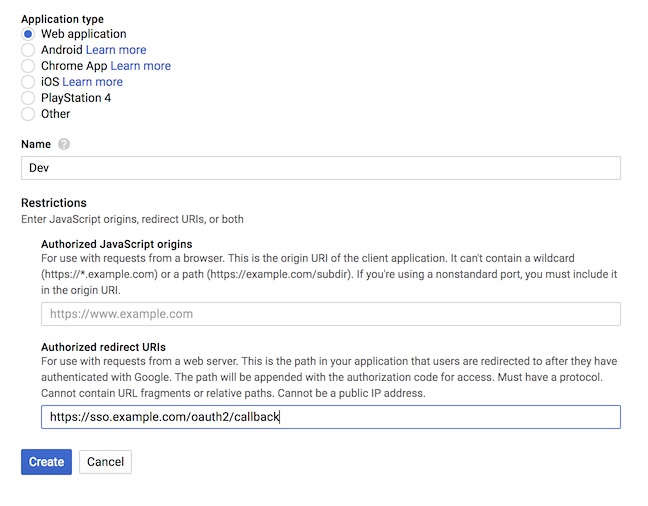

Once all of this has been entered, click the "Create" button. A dialog box will open with two
fields, a "client ID" and a "client secret". Copy both of these values to a safe and secure
location before clicking the "OK" button to proceed. The "client ID" and "client secret" strings
will be used to configure your `sso` deployment, as described below.

## Restricting authorization to particular Google groups on a domain

If desired, `sso` can be configured to only grant access to users that are members of particular
Google groups.

#### Create a service account

Begin by creating a "service account". This will be the identity assumed by `sso` when requesting
information about a user from Google. Go to the [Service Accounts] page in IAM/Admin, and verify
that the correct project name appears in the dashboard at the top of the page before proceeding.
Click "Create Service Account" toward the top of the page to begin creating the account.

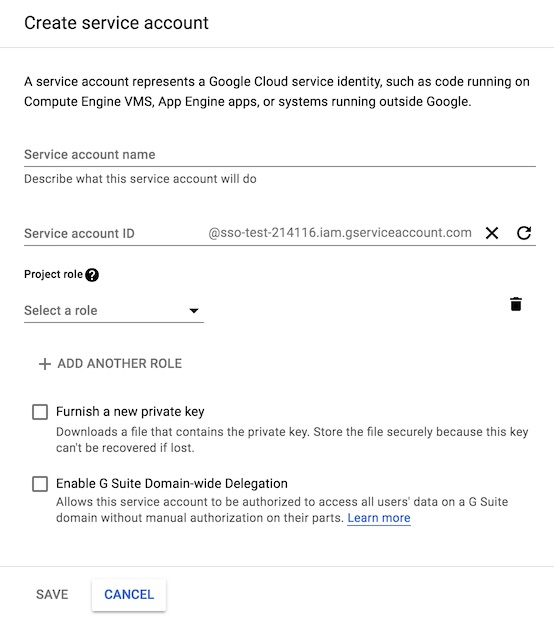

Fill out the fields requested as follows:
- **Service account name**: Any appropriate name is fine. We recommend `sso-authenticator`.
- **Service account ID**: Google will generate this as you type the "account name". We recommend
leaving as-is.
- **Project rol**: No project roles are required for `sso`.
- **Furnish a new private key**: Check this box, and select `JSON` as the "Key type".
- **Enable G Suite Domain-wide Delegation**: Check this box.

Click the "Save" button after entering this information. Google will download a `.json` file
through your browser containing a private key. Make sure not to lose this.

In the [Credentials](https://console.cloud.google.com/apis/credentials) page, you should now see
the service account that you just created listed under "OAuth 2.0 client IDs". Copy the "Client ID",
as it will be used in the next step.

#### Authorizing use of the Admin SDK API

Click [here](https://console.cloud.google.com/apis/library/admin.googleapis.com) to go to Google's
page for the "Admin SDK" API. Click "Enable" to enable the API for your project. Note that if the
API has already been enabled on your project, then you will see the word "API enabled" along with
a green checkmark.

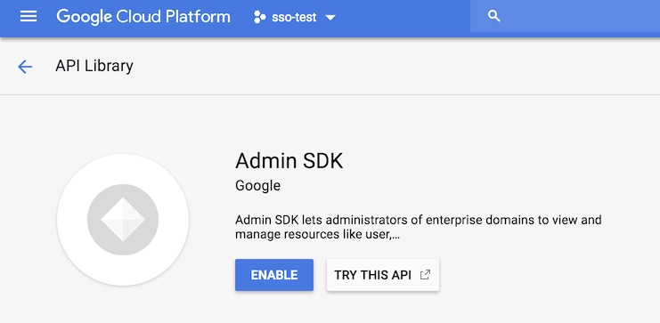

Go to the [Google Admin console](https://admin.google.com); note that you may be prompted to log
in again. Select "Security" from the available controls (click "More Controls" if it is not visible
when the page first loads).

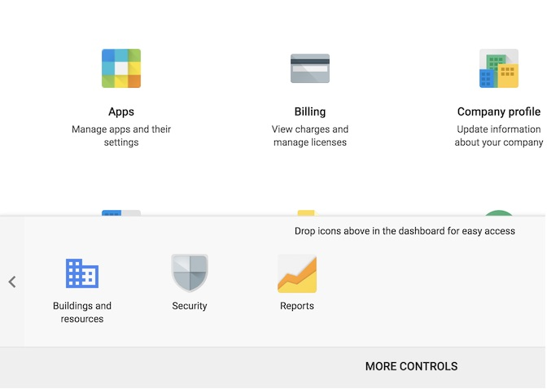

Click the "Advanced settings" option, and select "Manage API client access" from the resulting
panel.

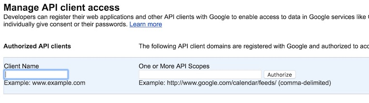

In the "Client Name" field, enter the Client ID of the service account that you have created. You
will need to provide the following "API Scopes" for the service account that we have created:
- `https://www.googleapis.com/auth/admin.directory.group.readonly`
- `https://www.googleapis.com/auth/admin.directory.user.readonly`

Type these into the field titled "One or More API Scopes", as a comma-separated list. After these
have been filled in, click the "Authorize" button.

#### Configuring `sso` to act as an administrator

When running the `sso-authenticator` binary, the following environment variables must be set, in
order to act as an administrator and access user group membership data:
- **`BUZZFEED_GOOGLE_ADMIN_EMAIL`**: An administrative email address on your organization's
domain, the identity of which can be assumed by `sso`.
- **`BUZZFEED_GOOGLE_SERVICE_ACCOUNT_JSON`**: A permanent location for the private key `.json` file 
that was downloaded through your browser at the time of service account creation. There is no
reason why this file should ever be accessed by any person or service other than `sso`; ensure that
file permissions are set accordingly.

If you already have an instance of `sso` running, then it will need to be restarted before these
changes will take effect.

## Docker and Docker Compose Provisioning

Next, third party dependencies must be installed and configuration files modified:

Setup Docker and Docker Compose on your machine by following the directions at https://docs.docker.com/compose/install/

Configure SSO
 
<flesh this out>

## Run the containers

Four containers are in the quickstart docker-compose.yml included in this repo. They are `sso_auth` and `sso_proxy`
containers, which run the `sso` code. A `nginx-proxy` container which acts as a dynamic proxy front-ending the cluster,
and lastly a `payload` container which runs the payload that's `sso` is providing auth services for.

Copy the `docker-compose.yml.example`, `env.example` and `proxy_configs.yml.example` files to new instances removing the
.example trailer on the file name.

Config those files per the instructions in http://./quickstart.md#docker-and-docker-compose-provisioning

Execute the containers by running the `sudo quickstart.sh` script, and run a `docker ps` to see all four containers are up.

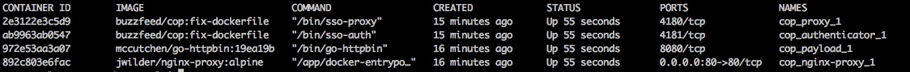

Open the payload via your browser with the address http://payload.sso.sso-test.io

Your browser will detect that you are not authenticated and re-direct you to the sso-auth at http://sso-auth.sso-test.io/sign_in?client_id=XXXX

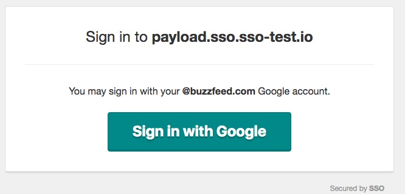

Press the Sign In With Google button

sso-auth will detect that you are not logged in and re-direct your to a google-auth page at https://accounts.google.com/signin/oauth/oauthchooseaccount?client_id=

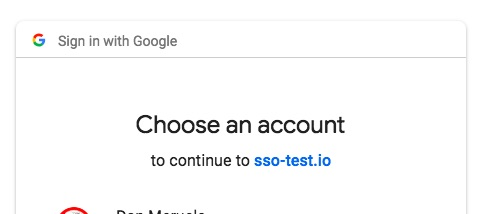

Choose the account you want to use that is authorized for with sso-proxy for this payload.
 
The google-auth will redirect you back to the desired payload page http://payload.sso.sso-test.io and you will now have access.

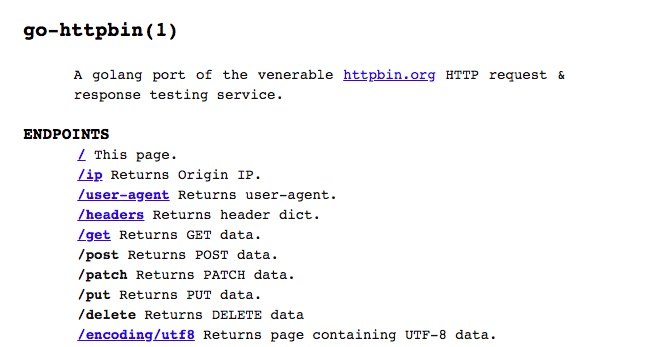
 
The `sso` payloads can be changed by following the https://./sso_config.md doc to change
sso-proxy configs and then restarting the sso-proxy container.
